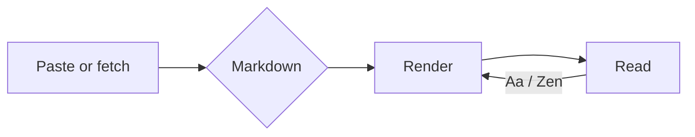

# Readmark

_A quiet reading room for Markdown._

Paste Markdown, or point Readmark at a **GitHub URL**, and read it the way a book wants to be read — your paper, your typeface, your pace.

> Bring the calm of a good reading app to technical text.

## Getting started

1. Press **Open** to paste Markdown or fetch a file from GitHub.
2. Tap **Aa** to set the theme, typeface, size, spacing, and page width.
3. Turn on **Zen** to declutter everything and spotlight the passage you're reading.

Your reading preferences are remembered between visits.

## What it renders

- Headings, nested lists, and **task lists**
  - [x] Syntax-highlighted code
  - [x] Tables with alignment
  - [ ] Your own document, next
- Block quotes, rules, and links
- Inline `code`, _emphasis_, and ~~strikethrough~~

### A little code

```js
// Memoised Fibonacci
const fib = (n, memo = {}) => {
  if (n < 2) return n;
  return (memo[n] ??= fib(n - 1, memo) + fib(n - 2, memo));
};

console.log(fib(42)); // 267914296
```

### Choosing a theme

| Theme    | Mood   | Best for      |
| -------- | ------ | ------------- |
| Original | Bright | Daylight      |
| Sepia    | Warm   | Long reading  |
| Night    | Dim    | Late sessions |
| Black    | Deep   | OLED screens  |

### Diagrams

Fenced `mermaid` blocks render as diagrams, tuned to your theme:



### Links

Inline [links](https://example.com), autolinks like <https://readmark.pages.dev>, and
reference-style links all work — see the [Mermaid docs][mmd] or [CommonMark][cm].

[mmd]: https://mermaid.js.org "Mermaid"
[cm]: https://commonmark.org "CommonMark"

---

Everything above is live Markdown. Replace it with your own from **Open**, or just start reading.
